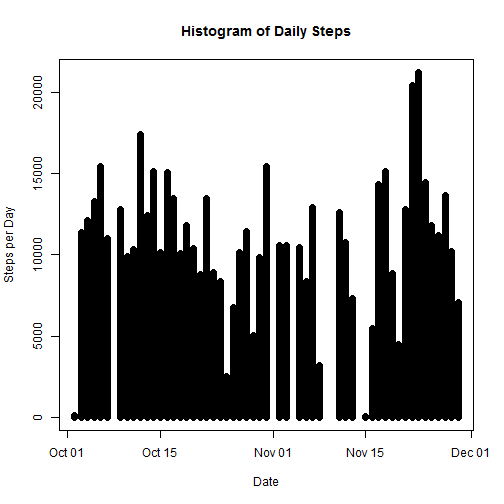
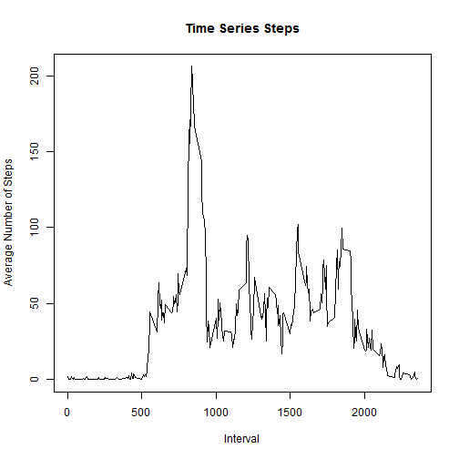
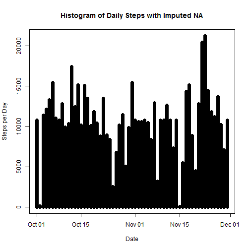
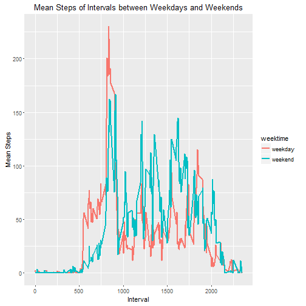

# What is mean total number of steps taken per day?

```r
library("plyr")
library("knitr")
library("reshape2")
library("ggplot2")
raw<-read.csv("C:/Users/Administrator/Documents/ds/activity.csv")
raw$date <- as.Date(raw$date)
newdata<-data.frame(na.omit(raw))
daily<-ddply(newdata,~date,summarise,sum=sum(steps))
plot(daily$date, daily$sum, type="h", main="Histogram of Daily Steps",xlab="Date", ylab="Steps per Day", col="black", lwd=7)
```



```r
round(mean(daily$sum))
```

```
## [1] 10766
```

```r
median(daily$sum)
```

```
## [1] 10765
```
# What is the average daily activity pattern?

```r
interval<-ddply(newdata,~interval,summarise,mean=mean(steps))
plot(interval$interval,interval$mean,type="l", main="Time Series Steps", xlab="Interval", ylab="Average Number of Steps")
```



```r
# The max avg steps interval is
a<-which.max(interval$mean)
interval[a,]$interval
```

```
## [1] 835
```

```r
# The steps for that interval is
max(interval$mean)
```

```
## [1] 206.1698
```
# Imputing missing values

```r
# Number of NAs
numNA<-dim(raw)[1]-dim(newdata)[1]
numNA
```

```
## [1] 2304
```

```r
# Use mean of the interval to replace NA
imput<-raw
naind<-which(is.na(imput))
a<-imput[naind,]
b<-merge(a,interval)
b<-subset(b,select = -steps)
b<-b[with(b,order(date)),]
imput[naind,1]<-b$mean
# Check if there is any NA left
sum(is.na(imput))
```

```
## [1] 0
```

```r
# Make a new histogram
newdaily<-ddply(imput,~date,summarise,sum=sum(steps))
plot(newdaily$date, newdaily$sum, type="h", main="Histogram of Daily Steps with Imputed NA",xlab="Date", ylab="Steps per Day", col="black", lwd=7)
```



```r
round(mean(newdaily$sum))
```

```
## [1] 10766
```

```r
median(newdaily$sum)
```

```
## [1] 10766.19
```
   
The overall shapes of the histograms don't differ, and the tiny increase in the means and medians is acceptable. Therefore the imputation should work.
 
# Are there differences in activity patterns between weekdays and weekends?

```r
week<-imput
week$weektime<-as.factor(ifelse(weekdays(week$date) %in% c("Saturday","Sunday"),"weekend","weekday"))
weekmean<-ddply(week,~interval+weektime,summarise,mean=mean(steps))
g<-ggplot(data=weekmean, aes(x=interval, y=mean,color=weektime))
g+geom_line(size=1)+labs(x="Interval", y="Mean Steps", title="Mean Steps of Intervals between Weekdays and Weekends")
```


   
We observe weekends has less activities during the early intervals(<1000), and more after that. This may be caused by that people get up rather late in the moring in weekends and have more personal activities during the day.
